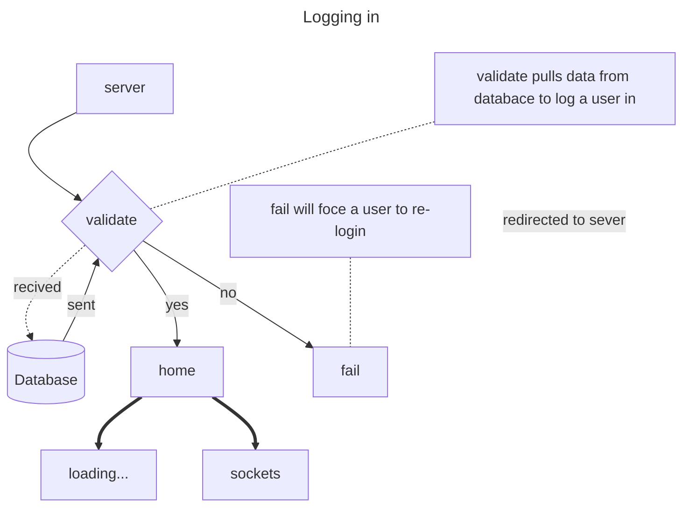
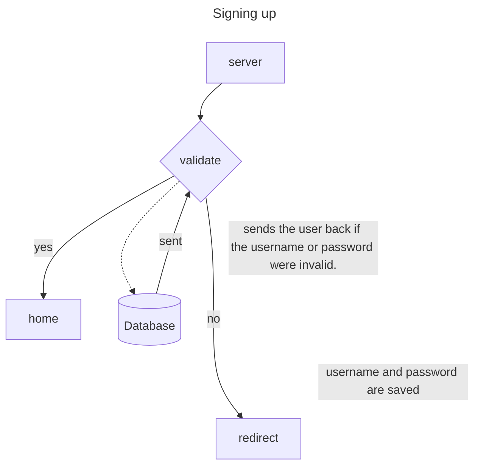
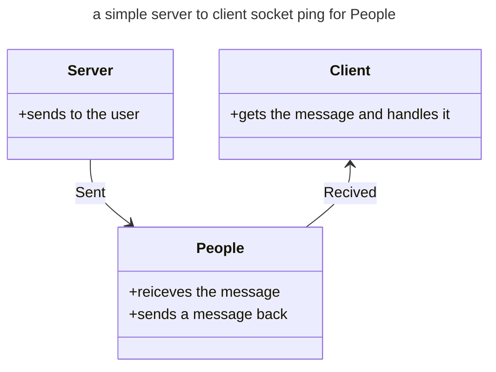
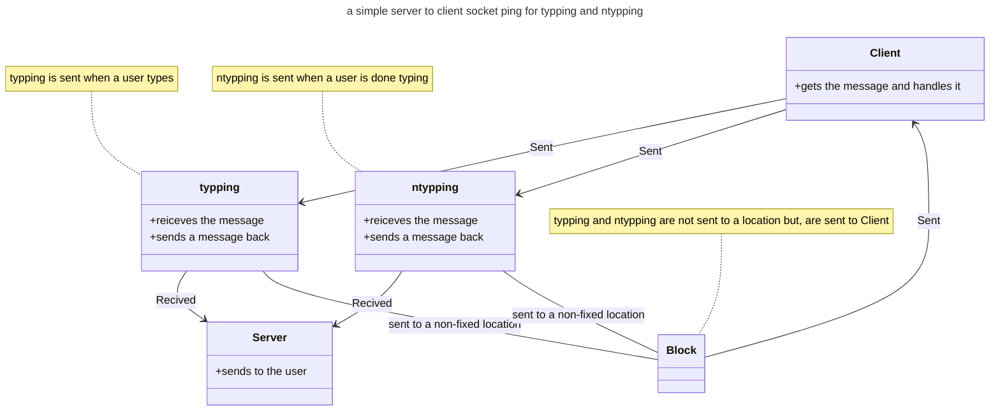
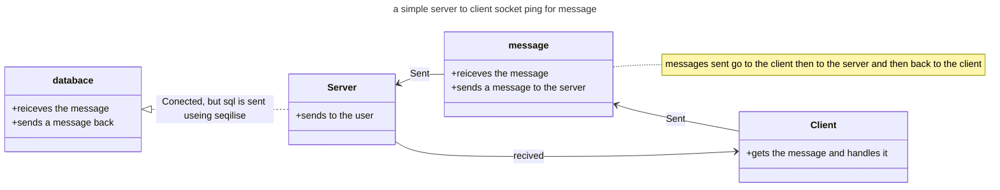
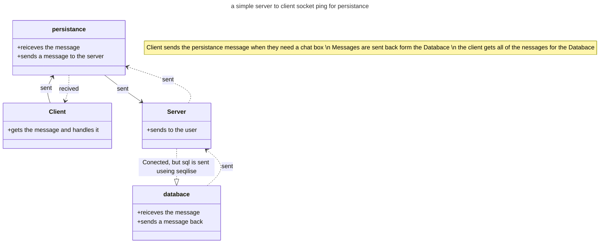
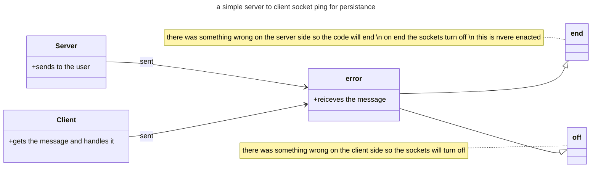
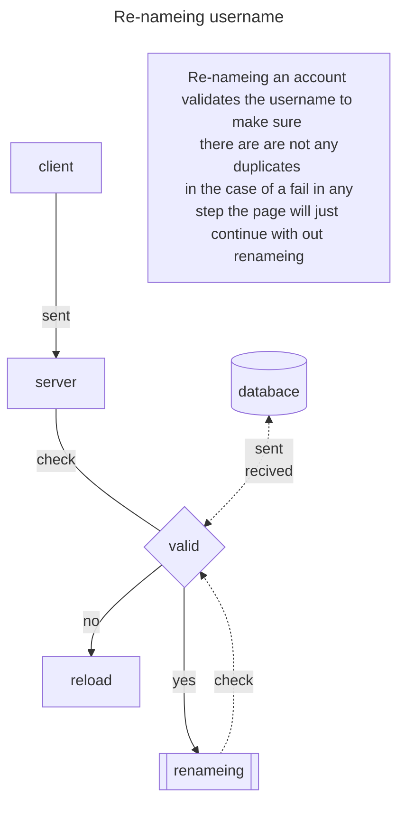
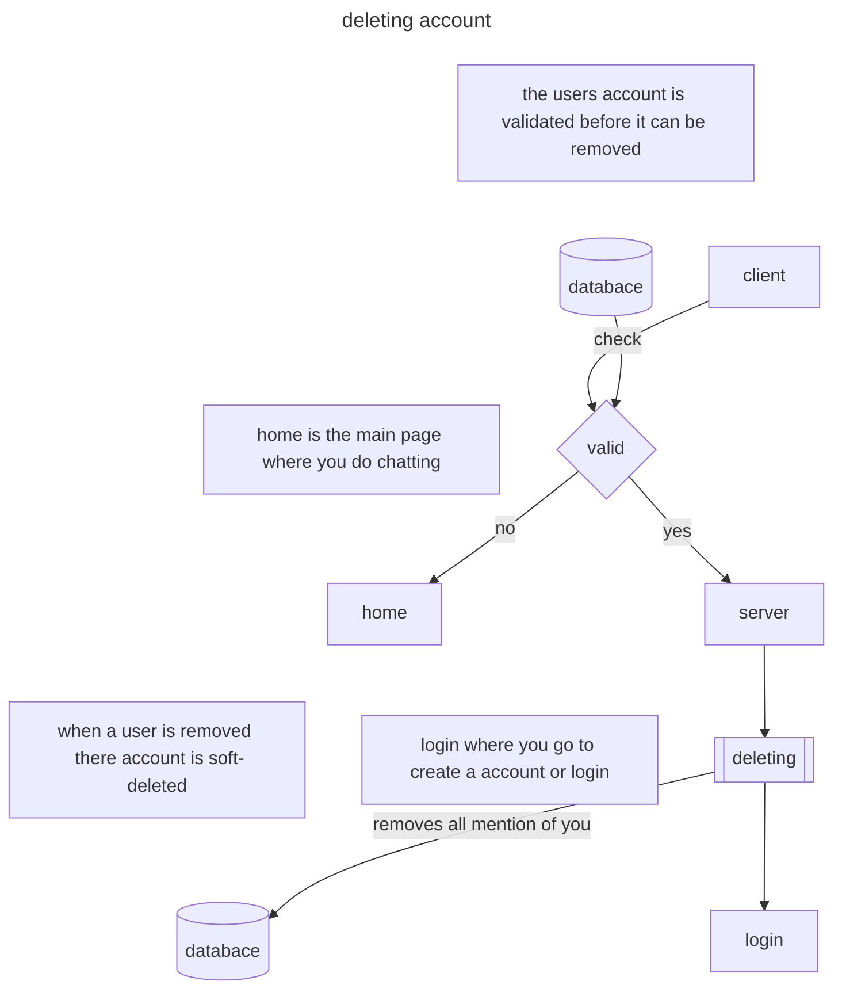

# Logging in <i class="fa-solid fa-user-lock"></i>

On this page, the user will log in. The user must log in with both username and password. The user will be redirected to a new page if the password and username are incorrect.


> > If a user tries to log in and has no page, they will be sent a **401** error code.

> > 

---

# Signing up <i class="fa-solid fa-user-plus"></i>

On this page, the user will sign up. If the username is already used, the account will not be created. Users may have the same password. Passwords are not stored in the table as raw text but as a hash.

password hashing is done by the <i class="fa-duotone fa-face-hand-peeking"></i>

```javascript
function hide(text) {
  return new Promise(function (resolve, reject) {
    bcrypt.genSalt(10, function (err, salt) {
      bcrypt.hash(text, salt, function (err, hash) {
        if (err) return reject(err);

        // Store hash in your password DB.
        resolve(hash);
      });
    });
  });
}
```


> > If a user tries to sign up and the username entered already exists, then a user is sent a **400** error message.

> > 

---

# Node <i class="fa-brands fa-node"></i>

```javascript
require("uuid");
```

the uuid module is used to create UUIDs for session IDs.

```javascript
require("cors");
```

the cors or the cross-origen module alows for post a get reqests to be cross-origen

```javascript
require("express");
```

The express module does a ton, from using get/post requests to handling the HTTP server.

> > `require("express-session")`
> > express-session is a module that alows a user to create sessions in express

```javascript
require("http");
```

http in this project creates the http server. Express handles the reqests and sessions

```javascript
require("path");
```

path allows for express to have /**name**

```javascript
require("socket.io");
```

socket are what allow for chats to work

```javascript
require("bcrypt");
```

hides the passwords in the Database

```javascript
require("sequelize");
```

sequelize is a huge module that allows coders to create sql requests easily

> > `require("sqlite3")`
> > the sqlite3 is reqired to allow the sequelize module to work

> > ## local install <i class="fa-thin fa-computer"></i>

```bash
npm install uuid cors express express-session http path socket.io bcrypt sequelize
```

# sockets <i class="fa-duotone fa-message-lines"></i>

> > ## client side <i class="fa-sharp fa-solid fa-person"></i>
> >
> > 1.  people
> >     1. gets all of the active and inactive members on the site.

> > 2.  sent
> >     1. gets wether or not a message was sent

> > 3.  message
> >     1. logs the **HTML** message

> > 4.  persistence
> >     1. gets all of the chat in that room

> > 5.  typping
> >     1. gets if the user is typping

> > 6.  ntypping
> >     1. gets if the user is done typping

## server side <i class="fa-solid fa-server"></i>

> > 1.  error
> >     1. dissconects the user from the sockets if the error is resolting in the user being unauthorized

> > 2. logedin
> >    1. validates the user on the serviside with sockets

> > 3. logremove
> >    1. gets if the user has removed there account and removes them completly from the member listing

> > 4. logedout
> >    1. gets if the user has logged out and changes there statatus to inactive

> > 5. persistence
> >    1. Returns the room code for users. If the users do not have a room code, they will create a room

> > 6. `socket.chat_room`
> >    1. brodcasts that a message has been sent. This is sent to the room

> > 7. typping
> >    1. emits to the room that there is a member typing

> > 8. ntypping
> >    1. send back to the client if they are finnised typping

> > 9. message
> >    1. adds messages to the messages table

---

# Diagrams <i class="fa-duotone fa-diagram-project"></i>

---

> > ## login page <i class="fa-solid fa-page"></i>

server --> validate --> if validate datatase & home
server --> validate --> if not validate redirected to sever

datatase --> validate
home --> loading & sockets



---

> > ## signup page <i class="fa-solid fa-page"></i>

server --> validate --> if validate datatase & home
server --> validate --> if not validate redirected to sever

datatase --> validate
home --> loading & sockets



---

> > ## sockets page <i class="fa-solid fa-page"></i>
> >
> > Server --> People --> Client



---

Client --> typping or ntypping
Server --> gets typping and or ntypping

block is just to show that typping and ntypping are prossesd by the Server



---

Client --> message --> Server --> Client and databace



---

Client --> persistance --> Server --> databace
databace --> Server --> persistance --> Client



---

Server --> error --> off
Client --> error --> end



---

> > > ## Update Username <i class="fa-duotone fa-users"></i>



---

> > > ## Update Password <i class="fa-duotone fa-user-ninja"></i>

```mermaid
---
title: Re-nameing password
---

flowchart TD

note[Re-nameing an password changes it\n there are are not any duplicates \n in the case of a fail in any step the page will just continue with out renameing] ~~~ databace

note2[the databace changes the password and is \nasked to validate the old one] ~~~ databace
a[server]
b[client]
c[[renameing]]
d{valid}
e[reload]
databace[(databace)]

b -->|sent| a


a ---|check| d

c ..->|sent| databace

d -->|yes| c

d -->|no| e

 databace.-> |sent| d
```

---

> > > ## deleting account <i class="fa-solid fa-trash"></i>



---

# html assets <i class="fa-solid fa-files"></i>

bootstrap is a html madule that can be imported. The modules have both .js and .css vareients to use. bootstrap allows for a user to create styling for diffrent html things. bootstrap is used to create the buttons in the [account page] and the popups in the [home page]. bootstrap 5 handdles the stying of the buttons buttons

bootstrap 3 handels the styling of the popups while jquery, notify and mouse0270 handle the script behind the popups.

mouse0270 is a add on to bootstrap 3 and hanndles window animations for popups
animate is used to add animations to css and is used for bootstrap popups as a bootstrap add on

jquery is an epic [DOM](https://developer.mozilla.org/en-US/docs/Web/API/Document_Object_Model/Introduction) coding resorce. It allows defelepers to write `$` insted of `document.nodeFinder`. jquery also uses ajax witch allows for a user to create `xmlhttprequest`. jquery also includes a whole libray of functions to simplify DOM.

socket.io is used to create [web sockets](https://developer.mozilla.org/en-US/docs/Web/API/WebSocket) for a user.
Socket.io is a simple libray that allows for a user to use websockets. Socket.io contains a http library as well as a websockets. Socket.io is used in both the client and server side.

This client side of socket.io handles what the use will see.
the server side handels what is sent to the client, what a user will see, and wether or no sockes should be connected. the server side also uses sessions to handle user information.

fontawesome is a free icon library. The libray allows a use to use the `<i class='icon'></>` to create butifull icons. each icon is a svg path.

swal is a library that uses javascript and css to create popups. swal is used in the iframe to inform the user of the next step.

w3schools is a coding reposotorry, and is a how to for coders. I used the css for

confetti allows a user to have confetti in the canvas. confetti is used in the Home tab canvas.

## iframe page <i class="fa-solid fa-page"></i>

| css | js                                                           |
| --- | ------------------------------------------------------------ |
|     | [fontawesome pro](https://kit.fontawesome.com/fd76b8450f.js) |
|     | [swal 2](https://cdn.jsdelivr.net/npm/sweetalert2@11)        |

## account page <i class="fa-solid fa-page"></i>

| css                                                                                           | html                                                                                               |
| --------------------------------------------------------------------------------------------- | -------------------------------------------------------------------------------------------------- |
| [bootstrap 5 v5.2.1](https://cdn.jsdelivr.net/npm/bootstrap@5.2.1/dist/css/bootstrap.min.css) | [bootstrap 5 v5.2.1](https://cdn.jsdelivr.net/npm/bootstrap@5.2.1/dist/js/bootstrap.bundle.min.js) |

## home page <i class="fa-solid fa-page"></i>

| css                                                                                           | js                                                                                                                     |
| --------------------------------------------------------------------------------------------- | ---------------------------------------------------------------------------------------------------------------------- |
| [animate 3.2.3](https://cdnjs.cloudflare.com/ajax/libs/animate.css/3.2.3/animate.min.css)     | [crypto 3.1.2](https://cdnjs.cloudflare.com/ajax/libs/crypto-js/3.1.2/rollups/aes.js)                                  |
| [w3schools](https://www.w3schools.com/w3css/4/w3.css)                                         | [jquery 3.6.0](https://cdnjs.cloudflare.com/ajax/libs/jquery/3.6.0/jquery.min.js)                                      |
| [bootstrap 5 v5.2.1](https://cdn.jsdelivr.net/npm/bootstrap@5.2.1/dist/css/bootstrap.min.css) | [socket.io](/socket.io/socket.io.js)                                                                                   |
|                                                                                               | [bootstrap 3 v/3.1.5](https://cdnjs.cloudflare.com/ajax/libs/mouse0270-bootstrap-notify/3.1.5/bootstrap-notify.min.js) |
|                                                                                               | [marked 0.3.2](https://cdnjs.cloudflare.com/ajax/libs/marked/0.3.2/marked.min.js)                                      |
|                                                                                               | [confetti latest](https://cdn.jsdelivr.net/npm/js-confetti@latest/dist/js-confetti.browser.js)                         |
